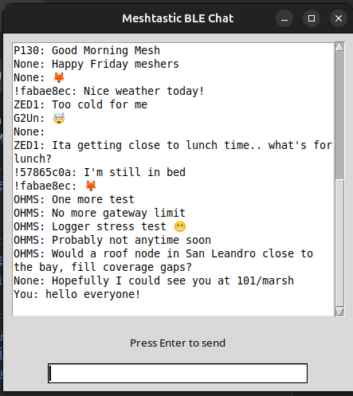

# MeshChat

Simple Primary Channel Chat client for Meshtastic




## Preparing

Clone the repo from gitHub with:
``` bash 
gh repo clone pablorevilla-meshtastic/MeshChat
```
Create a python virtual environment:
``` bash
cd MeshChat
```
``` bash
python3 -m venv env
```
Install the environment requirements:
``` bash
./env/bin/pip install -r requirements.txt
```
 Edit `config.ini` and change the IP address of your Meshtastic node.
 ```bash
 nano config.ini
 ``` 
```ini
[node]
# Replace with your Meshtastic node's IP address or MAC Address for BLE connection
node_ip = 192.168.0.10 
MAC_ADDRESS = FA:B6:D2:73:3F:CA
```

## Running Chat
Start the chat client for BLE
``` bash
./env/bin/python chatble.py
```
Start the chat client for IP
``` bash
./env/bin/python chatip.py
```
